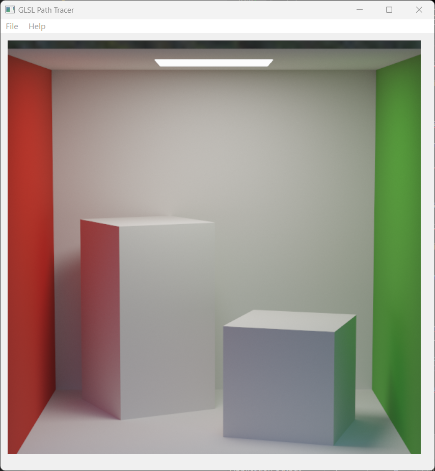
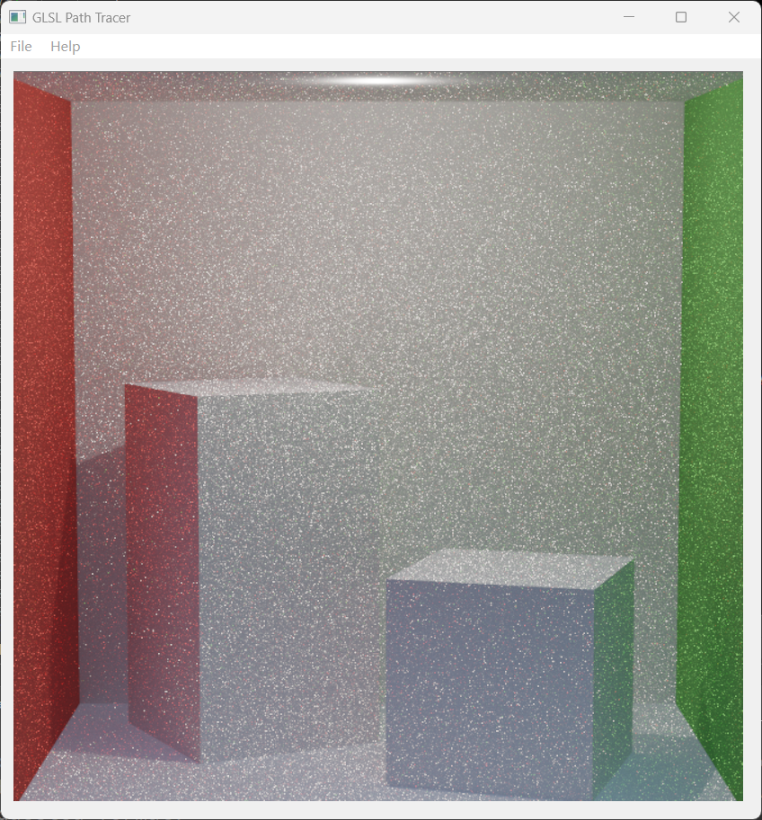
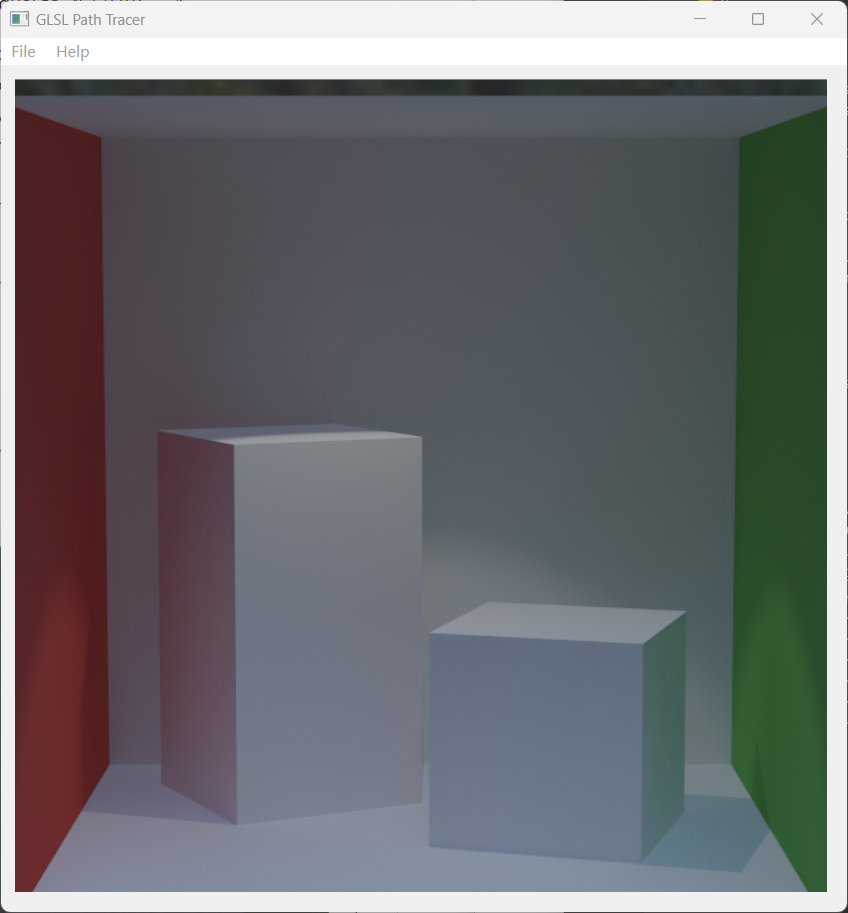
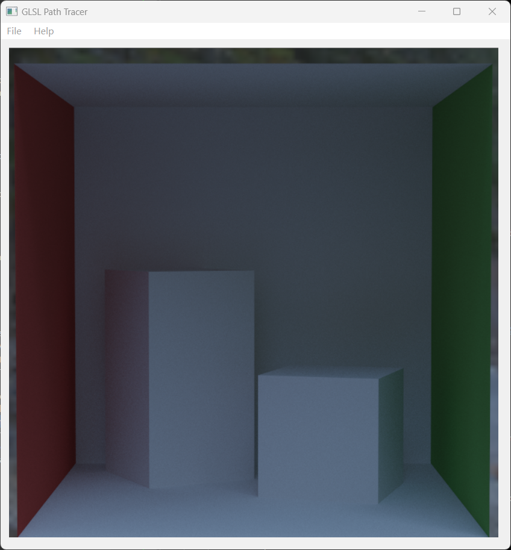
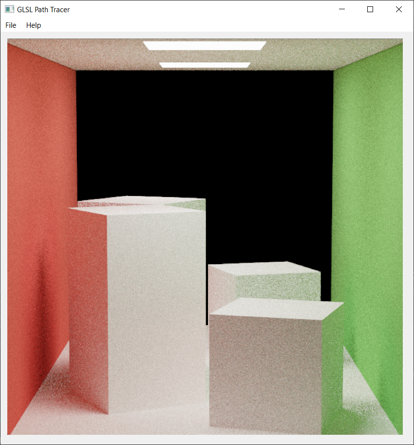
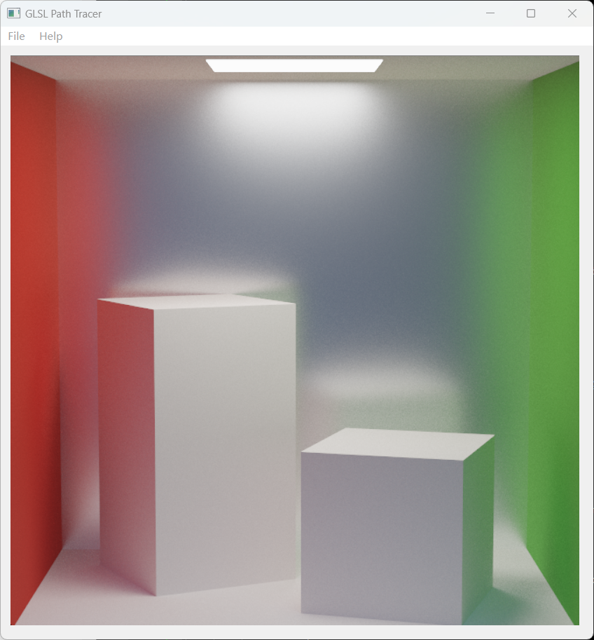
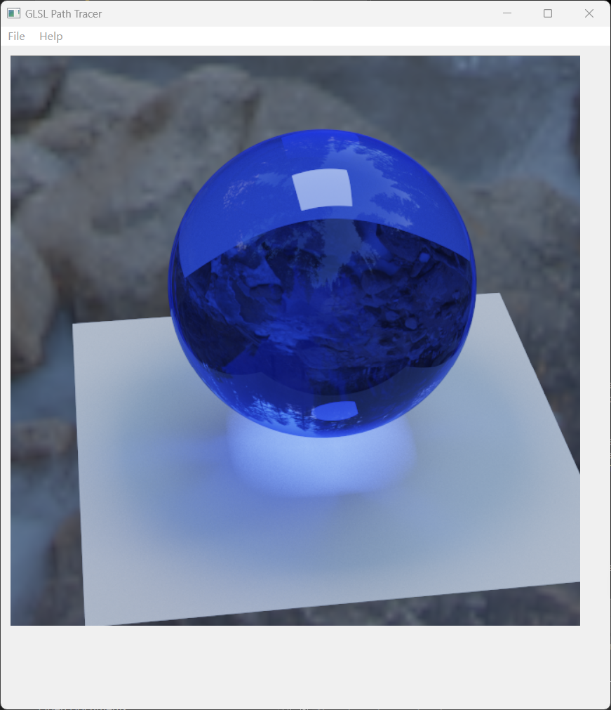
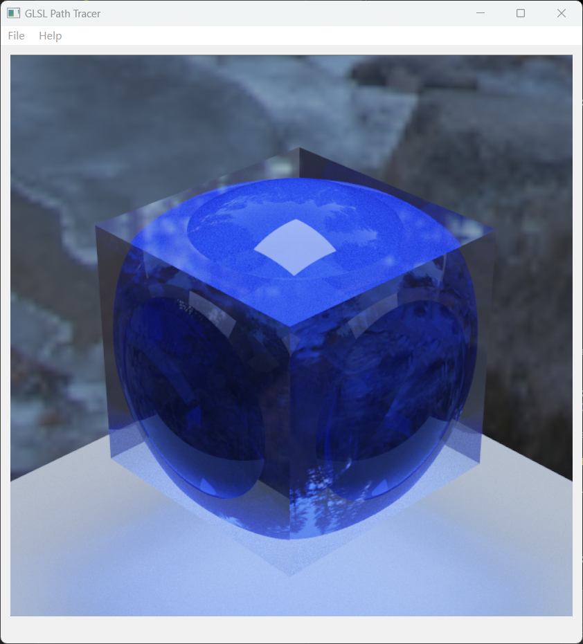

# GLSL Path Tracer — Global Illumination

A GPU-accelerated path tracer implemented entirely in **GLSL fragment shaders** using **OpenGL 3.3 + Qt 6**. All rendering logic runs on the GPU — each pixel is a fragment shader invocation that traces rays through the scene and accumulates light progressively across frames.

---

## Renders

| Cornell Box (Full) | Point Light | Spot Light |
|---|---|---|
|  |  |  |

| No Lights (Env Map) | Mirror Box | Rough Mirror |
|---|---|---|
|  |  |  |

| Mirror Sphere | Glass Ball (Blue) | Glass Ball (Cone) |
|---|---|---|
|  |  |  |

---

## Architecture

```
CPU (Qt / C++)                GPU (GLSL Fragment Shader)
─────────────────             ──────────────────────────────────────
Upload uniforms          →    pathtracer.defines.glsl     structs, math utils, RNG
Upload scene data        →    pathtracer.intersection.glsl  ray-scene intersection
Render full-screen quad  →    pathtracer.bsdf.glsl          material / BSDF evaluation
Accumulate frames        →    pathtracer.sampleWarping.glsl  sampling functions
                              pathtracer.light.glsl          light sampling, MIS
                              pathtracer.frag.glsl           Li_Naive / Li_Full integrators
```

Progressive rendering: each frame blends with the accumulated result via `mix(last, current, 1/iteration)`, converging over time.

---

## Features

### Integrators

- **`Li_Naive`** — iterative path tracing, accumulates `Le` only on direct light hit, no direct light sampling
- **`Li_Full`** — full path tracer with direct lighting + global illumination at every bounce

### Light Sources

| Type | Sampling |
|---|---|
| Area Light (Rectangle) | Uniform surface sampling, solid-angle PDF conversion |
| Area Light (Sphere) | Cone sampling from visible cap |
| Point Light | Direct, no MIS needed |
| Spot Light | Inner/outer cone falloff with `smoothstep` |
| Environment Map (HDR) | Cosine-weighted hemisphere sampling |

### Multiple Importance Sampling (MIS)

`ComputeDirectLight_MIS` combines light-source sampling and BSDF sampling using the **power heuristic**:

```
weight = (nf * fPdf)^2 / ((nf * fPdf)^2 + (ng * gPdf)^2)
```

- Area lights: full MIS (light sample + BSDF sample)
- Point / Spot lights: light sample only (BSDF ray can never hit a point light)
- Specular surfaces: skip MIS, add `Le` directly to avoid double-counting

### BSDF Materials

| Material | Implementation |
|---|---|
| Diffuse | Lambertian, cosine-weighted hemisphere sampling |
| Specular Reflection | Perfect mirror, `wi = reflect(wo)` |
| Specular Transmission | Snell's law refraction |
| Glass (Dielectric) | Fresnel blend of reflection + transmission |
| Microfacet (GGX) | Trowbridge-Reitz NDF + Smith shadowing-masking |

### Ray-Scene Intersection

Supports the following primitives, all transformed via inverse transform matrices:

- Rectangle
- Box (slab method)
- Sphere (analytic quadratic)
- Triangle Mesh (Möller–Trumbore, data packed into `sampler2D`)

### Texture Support

- Albedo maps (gamma-corrected)
- Normal maps (tangent-space, TBN transform)
- Roughness maps

---

## Tech Stack

- **Language**: C++17 (host) + GLSL 3.30 (GPU)
- **Framework**: Qt 6 (`QOpenGLWidget`)
- **Build**: qmake
- **Math**: GLM
- **Scene format**: JSON
- **Max ray depth**: 10 bounces

---

## Project Structure

```
glsl/
  pathtracer.defines.glsl       constants, structs, math helpers, RNG
  pathtracer.sampleWarping.glsl disk/hemisphere/sphere sampling
  pathtracer.intersection.glsl  per-primitive ray intersection
  pathtracer.bsdf.glsl          f(), Sample_f(), Pdf() per material
  pathtracer.light.glsl         Sample_Li(), Pdf_Li(), MIS direct lighting
  pathtracer.frag.glsl          Li_Naive, Li_Full, main()
src/
  scene/                        C++ scene loading, geometry, lights, materials
  mygl.cpp                      OpenGL setup, render loop, framebuffer ping-pong
jsons/                          scene description files
images/                         render outputs
```
